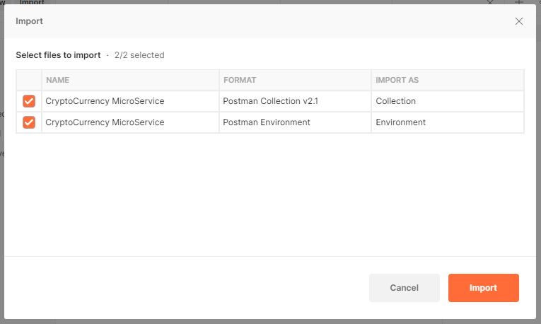
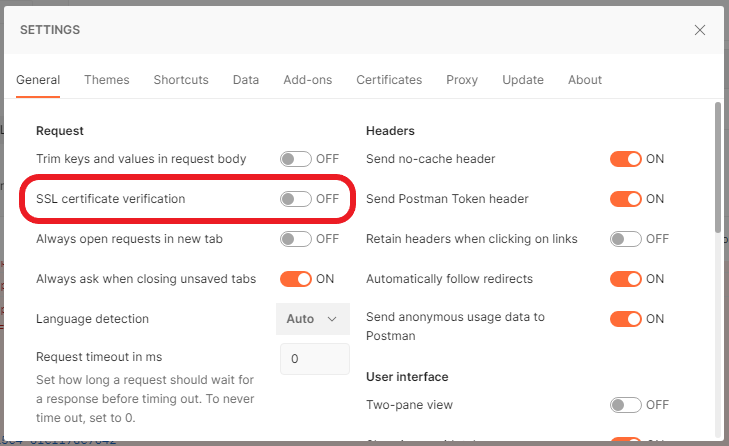
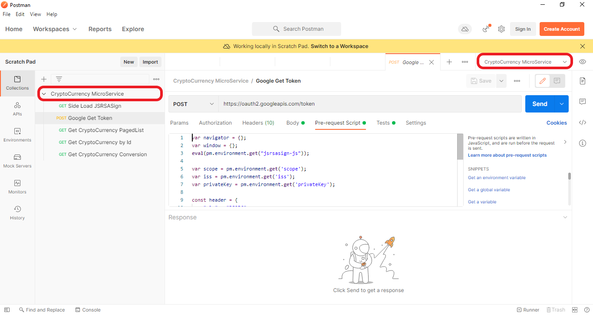
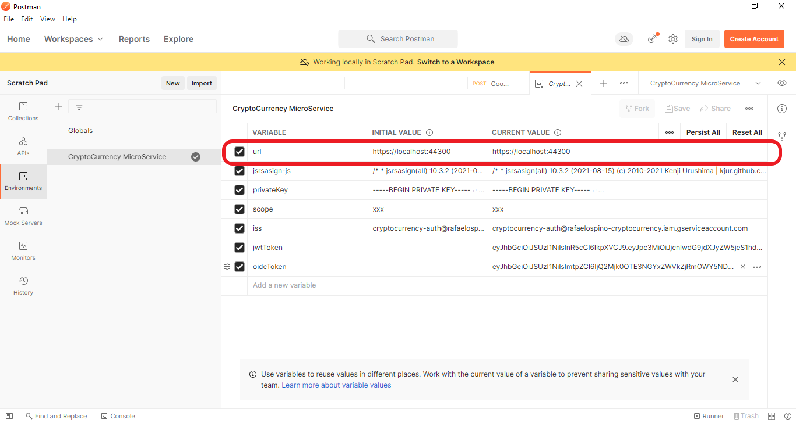
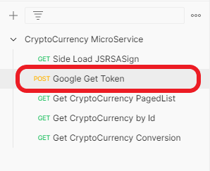
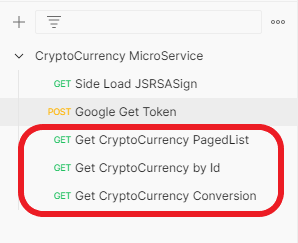
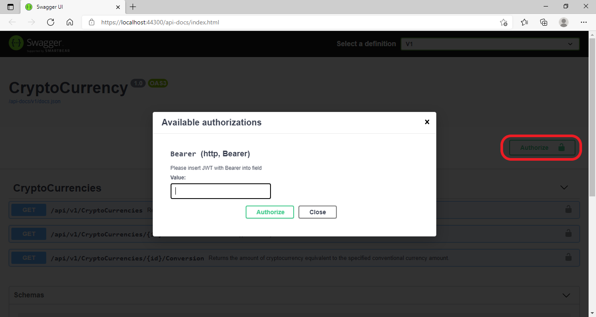

# Integration Tests #

## Postman ##

Para facilitar las pruebas del microservicio junto con sus dependencias se creo una colección de solicitudes en Postman que permiten la generación de un token de autenticación válido y la invocación a las operaciones del microservicio con dicho token.

 Para poder invocar el servicio desde Postman ejecutar los siguientes pasos.

 1. Ingresar al menu "File/Import" o <kbd>Ctrl</kbd> + <kbd>O</kbd> e importar los archivos [CryptoCurrency MicroService.postman_collection.json](../tests/IntegrationTests/CryptoCurrency%20MicroService.postman_collection.json) y [CryptoCurrency MicroService.postman_environment.json](../tests/IntegrationTests/CryptoCurrency%20MicroService.postman_environment.json).

    
 2. Ingresar al menu "File/Settings" o <kbd>Ctrl</kbd> + <kbd>,</kbd> y Deshabilitar "SSL certificate verification".
 
    
 3. Asegurese de seleccionar la colección (collection) y el ambiente (environment) llamados "CryptoCurrency MicroService".
 
    
 4. Inicie el Microservicio ya sea desde Visual Studio presionando <kbd>F5</kbd> o a través de la consola desde la raiz de la carpeta del proyecto Weelo.RafaelOspino.Api ejecutando el comando.
    ```console 
    dotnet run
    ```
 5. Ajuste la variable url en el ambiente "CryptoCurrency MicroService" de acuerdo a la url base de ejecución del Microservicio.

    
 6. Ejecute el request llamado "Google Get Token" para obtener un token de autenticación valido. El token tiene duración de 1 hora.

    
 7. Ahora puede ejecutar cualquiera de las 3 operaciones que ofrece el microservicio. 
 
    

## Swagger Docs ##

Tambien es posible porbar el servicio desde la documentación de Swagger (/api-docs), para ello es necesario generar el Token del punto 7 e ingresarlo en la opción **Authorize**.

   